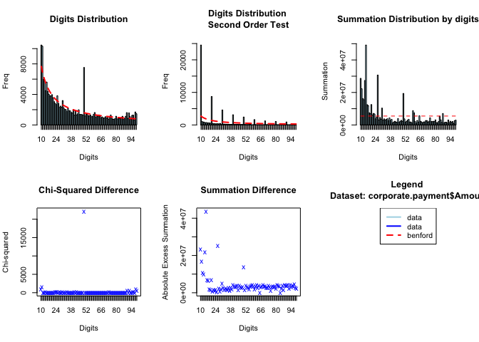

<!-- README.md is generated from README.Rmd. Please edit that file -->
[](https://travis-ci.org/carloscinelli/benford.analysis) [](https://codecov.io/github/carloscinelli/benford.analysis?branch=master) [](https://cran.r-project.org/package=benford.analysis) 

The Benford Analysis (`benford.analysis`) package provides tools that make it easier to validate data using Benford's Law. The main purpose of the package is to identify suspicious data that need further verification.

CRAN
----

You can install the package from CRAN by running:

``` r
install.packages("benford.analysis")
```

How to install the development version from GitHub
--------------------------------------------------

To install the GitHub version you need to have the package `devtools` installed. Make sure to set the option `build_vignettes = TRUE` to compile the package vignette.

``` r
# install.packages("devtools") # run this to install the devtools package
devtools::install_github("carloscinelli/benford.analysis", build_vignettes = TRUE)
```

Example usage
-------------

The `benford.analysis` package comes with 6 real datasets from Mark Nigrini's book [Benford's Law: Applications for Forensic Accounting, Auditing, and Fraud Detection](http://www.amazon.com/gp/product/B007KG9ZAI/ref=as_li_ss_tl?ie=UTF8&camp=1789&creative=390957&creativeASIN=B007KG9ZAI&linkCode=as2&tag=analreal-20).

Here we will give an example using 189.470 records from the corporate payments data. First we need to load the package and the data:

``` r
library(benford.analysis) # loads package
data(corporate.payment) # loads data
```

Then to validade the data against Benford's law you simply use the function `benford` in the appropriate column:

``` r
bfd.cp <- benford(corporate.payment$Amount)
```

The command above created an object of class "Benford" with the results for the analysis using the first two significant digits. You can choose a different number of digits changing the `number.of.digits` paramater. For more information and parameters see `?benford`:

Let's check the main plots of the analysis:

``` r
plot(bfd.cp)
```



The original data is in blue and the expected frequency according to Benford's law is in red. For instance, in our example, the first plot shows that the data do have a tendency to follow Benford's law, but also that there is a clear discrepancy at 50.

You can print the main results of the analysis:

``` r
bfd.cp
#> 
#> Benford object:
#>  
#> Data: corporate.payment$Amount 
#> Number of observations used = 185083 
#> Number of obs. for second order = 65504 
#> First digits analysed = 2
#> 
#> Mantissa: 
#> 
#>    Statistic  Value
#>         Mean  0.496
#>          Var  0.092
#>  Ex.Kurtosis -1.257
#>     Skewness -0.002
#> 
#> 
#> The 5 largest deviations: 
#> 
#>   digits absolute.diff
#> 1     50       5938.25
#> 2     11       3331.98
#> 3     10       2811.92
#> 4     14       1043.68
#> 5     98        889.95
#> 
#> Stats:
#> 
#>  Pearson's Chi-squared test
#> 
#> data:  corporate.payment$Amount
#> X-squared = 32094, df = 89, p-value < 2.2e-16
#> 
#> 
#>  Mantissa Arc Test
#> 
#> data:  corporate.payment$Amount
#> L2 = 0.0039958, df = 2, p-value < 2.2e-16
#> 
#> Mean Absolute Deviation: 0.002336614
#> Distortion Factor: -1.065467
#> 
#> Remember: Real data will never conform perfectly to Benford's Law. You should not focus on p-values!
```

The print method first shows the general information of the analysis, like the name of the data used, the number of observations used and how many significant digits were analyzed.

After that you have the main statistics of the log mantissa of the data. If the data follows Benford's Law, the numbers should be close to:

| Statistic    | Value           |
|--------------|-----------------|
| Mean         | 0.5             |
| Variance     | 1/12 (0.08333…) |
| Ex. Kurtosis | -1.2            |
| Skewness     | 0               |

Printing also shows the 5 largest discrepancies. Notice that, as we had seen on the plot, the highest deviation is 50. These deviations are good candidates for closer inspections. It also shows the results of statistical tests like the Chi-squared test and the Mantissa Arc test.

The package provides some helper functions to further investigate the data. For example, you can easily extract the observations with the largest discrepancies by using the `getSuspects` function.

``` r
suspects <- getSuspects(bfd.cp, corporate.payment)
suspects
#>        VendorNum       Date       InvNum  Amount
#>     1:      2001 2010-01-02      3822J10   50.38
#>     2:      2001 2010-01-07     100107-2 1166.29
#>     3:      2001 2010-01-08  11210084007 1171.45
#>     4:      2001 2010-01-08      1585J10   50.42
#>     5:      2001 2010-01-08      4733J10  113.34
#>    ---                                          
#> 17852:     52867 2010-07-01 270358343233   11.58
#> 17853:     52870 2010-02-01 270682253025   11.20
#> 17854:     52904 2010-06-01 271866383919   50.15
#> 17855:     52911 2010-02-01 270957401515   11.20
#> 17856:     52934 2010-02-01 271745237617   11.88
```

More information can be found on the help documentation and examples. The vignette will be ready soon.
